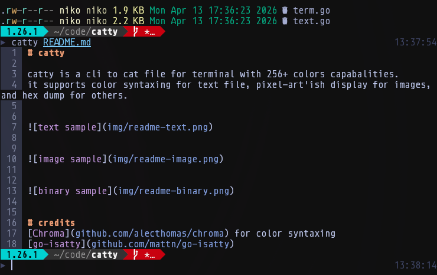
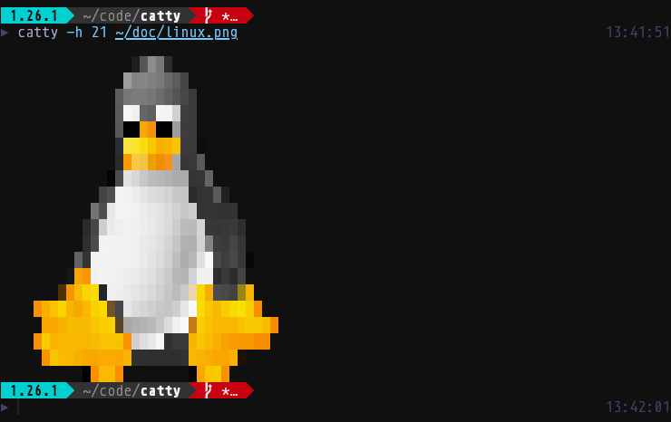
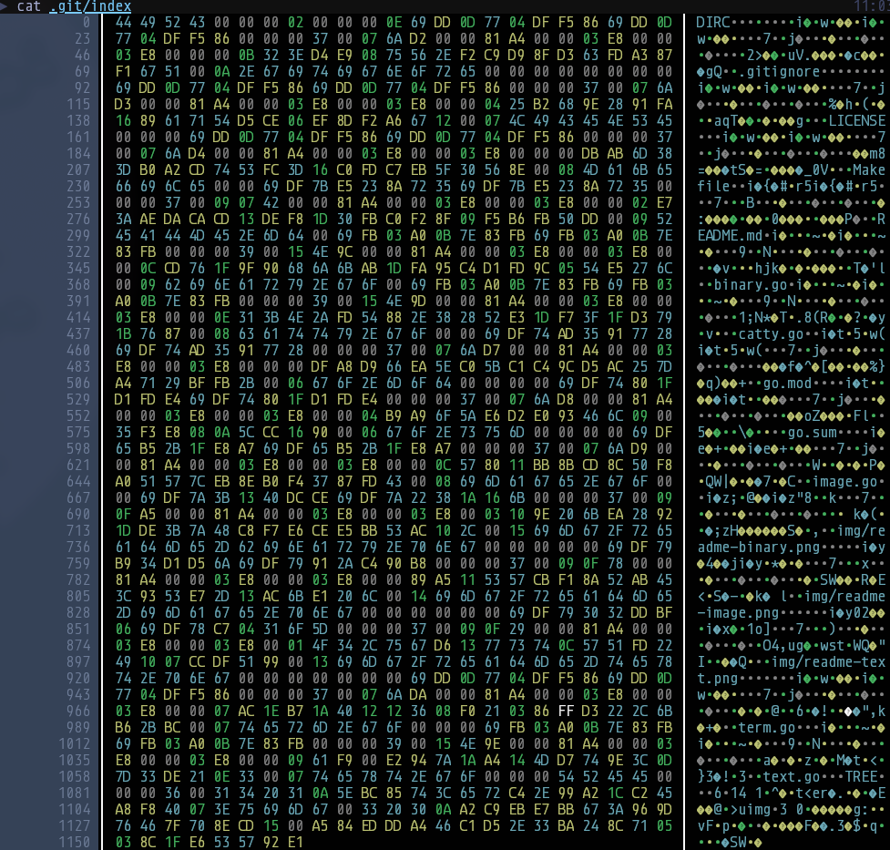

# catty

catty is a cli to cat file for terminal with 256+ colors capabalities.
it supports color syntaxing for text file, pixel-art'ish display for images, and hex dump for others.

## text 



## image 



## other



# help

```
▶ catty -h
flag needs an argument: -h
Usage of catty:
  -d	debug mode
  -h int
    	max lines (used for image only, default: terminal height)
  -m string
    	force file mime type
  -r	raw mode (no decoration)
  -v	show version
  -w int
    	max columns (default: terminal width)
```

# credits
- [Chroma](github.com/alecthomas/chroma) for color syntaxing
- [go-isatty](github.com/mattn/go-isatty)
